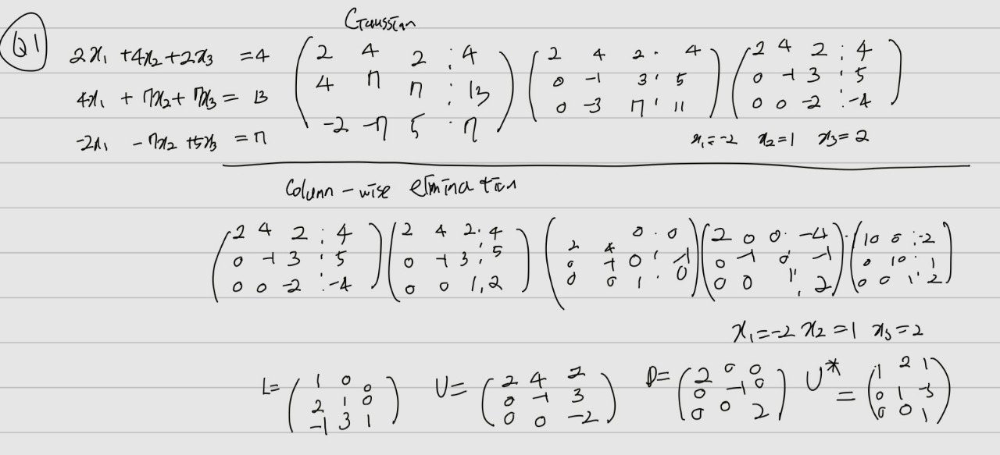
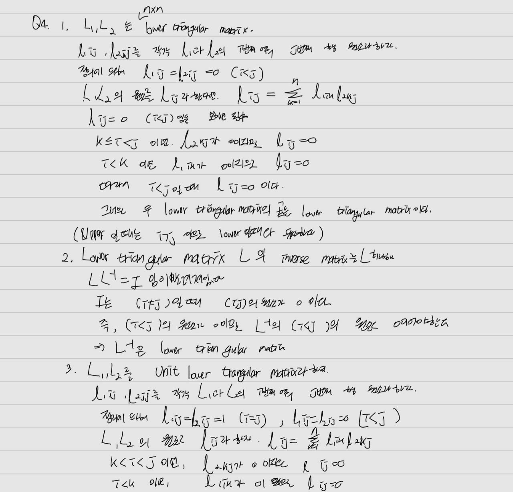
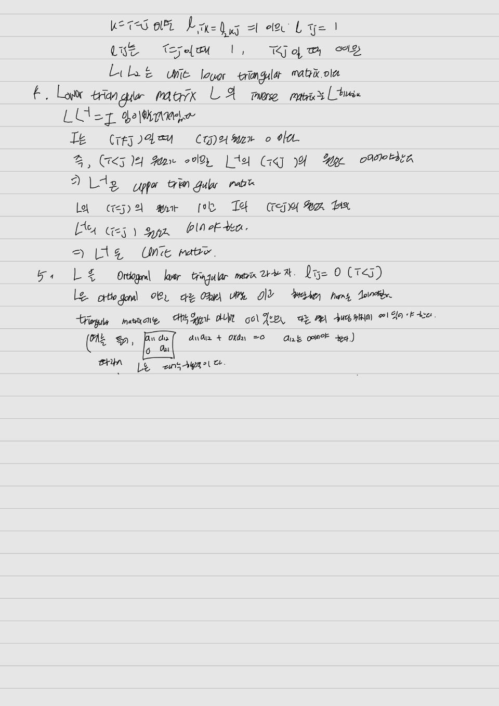

# M1399.0001000 Homework 1, Spring 2024, Seoul National University
Due 23:00 2023-03-31

#### **No late submission is accepted**. 

#### Note
- Submit **both** your **Rmd file** and the **pdf file** knitted from the Rmd file.
- For Q1 and Q4, both markdown text and handwritten solutions are accepted. For handwritten solutions, scan your solutions and **attach them to the knitted pdf file**.
- For Q2-4 and 2-5, be careful of infinite loops or long running time.

## Q1. Textbook Problem

1. Textbook Chapter 2, Q2.1.: Find the solution of the following linear equations using the row-wise elimination method (Gaussian elimination) as well as the column-wise elimination method. Also, obtain LDU decomposition for each case.  

\begin{eqnarray*}
    2x_1 + 4x_2 + 2x_3 &=& 4 \\
    4x_1 + 7x_2 + 7x_3 &=& 13 \\
    -2x_1 - 7x_2 + 5x_3 &=& 7
\end{eqnarray*}



## Q2. Floating point

1. Run the following R code and explain its outcomes.
```{r }
	.1 == .3/3
	x <- seq(0, 1, by=.1)
	x[4] == .3
	all.equal(x[4], .3)
	print(x[4], digits=20)
	print(.3,   digits=20)
```


</br>

컴퓨터는 2진수를 기반으로 수를 표현하기에 10진수로 표현된 (0.1, 0.3/3) 등을 2진수 표현으로 바꾸어야 한다. 이 과정에서 깔끔히 변환되지 않고 남은 부분을 반올림으로 처리하게되고 이때문에 약간의 차이가 발생한다. 0.1과 0.3/3 그리고 x[4]와 .3 을 각각 bits()함수를 이용하여 2진수 표현으로 바꾸어 보면 라운딩이 발생하는 마지막 부분의 비트가 다른 것을 확인할 수 있다.
```{r}
x <- seq(0, 1, by=.1)
x[4] == .3
pryr::bits(.1)
pryr::bits(.3/3)
pryr::bits(x[4])
pryr::bits(.3)
```

all.equal()함수를 help창에 입력해보면 'near equality’를 비교한다고 쓰여있다. 어느정도 차이는 감안하고 딩일성을 비교하는 함수인다. tolerance인자로 차이를 용인하는 정도를 지정할 수 있으며, 기본값은 1.5e-8이다. tolerance를 0으로 설정하면 두 객체간의 아주 정확한 차이값을 반환한다.


```{r}
	all.equal(x[4], .3, tolerance = 0)
```
	print(x[4], digits=20)와	print(.3,   digits=20)의 차이는 라운딩 방식에 의해 나타난다.
	x[4]는 1/10*3으로 구현된 숫자이다. 따라서 라운딩이 2번(1/10에서 한번, x3에서 한번) 일어났을 것이다. 그렇기에 라운딩이 한번 일어난 0.3과의 차이가 발생한다. R은 Round to nearest, ties to even이라는 최하위 비트가 0이면 버림을 1이면 올림을 한다. 0.3은 최하위비트가 0이기에 버림을 했을 거고 x[4]는 1이기에 올림을 했을 것이다. 둘의 비트 마지막을 보면 0011과 0100으로 0011에 1을 더한다면 0100이 나온다.  
```{r}
1/10*3 == x[4]
pryr::bits(1/10)
```

2. In R, compare the result of
```{r eval=FALSE}
	1 / 2^52 * 2^(-1022)
```
with `.Machine$double.xmin`. Why are there this difference?
```{r}
.Machine$double.xmin
```
	`1 / 2^52 * 2^(-1022)`은 가장 작은 subnormal floating number이고 `.Machine$double.xmin`은 가장 작은 non-subnormal floating number이다. 즉, 어떤 실수를 가장 가까운 부동소수점실수로 반올림하였을 때의 오차의 한계인 머신입실론을 넘어가는 언더플로우를 일으킬 수 있는 `1 / 2^52 * 2^(-1022)`숫자의 최소치이다.
	
	
</br>


3. In the field of real numbers, the identity element, $a$, of addition satisfies the following three conditions.
    + $a = 0$ is unique.
    + $a + x = x$ for any $x$. 
    + $x - x = a$ for any $x$.
Are these conditions hold for the system of floating point numbers? Discuss.

</br>
해당성질을 만족하지 않는다. 반올림을 하는 특성때문에 다른 floating point number가 연산에서 같은 값을 표현하게될 수 있다.


4. Write an R program that computes
$$
    \sum_{i=1}^{\infty}i
    .
$$
Will the computations overflow? If so, approximately at what value of `i`? Or will the series converge? If so, to what value, and approximately at what value of `i`? Explain the observed behavior of R in terms of the parameters of the IEEE 754 standard.
```{r}
Rcpp::cppFunction('int float32bin(double x) {
  float flx = (float) x;
  unsigned int binx = *((unsigned int*)&flx);
  return binx;
}')

```

```{r eval=FALSE}
	## Write your R program here
i = 1
sum = 0
repeat{
    i = i+1
    sum = sum+i 
  }
}
```
시간이 너무 오래걸려 overflow를 일으키진 못했지만 해당 식은 발산함이 알려져 있고 singleprecision 에서 MAX값은 2^127이므로 2^128부터 무한과 같게 됨을 알 수 있다. n까지의 합은 n(n+1)/2이므로 2^128>=n(n=1)/2인 n값은 2^64정도이다. 따라서 대략적으로 n이 2^65일때부터 singleprecision에서 overflow가 발생한다고 생각할 수 있다. 아래를 보면 확인할 수 있다.


```{r}
n=2^65
pryr::bits(float32bin(n*(n+1)/2)) == pryr::bits(float32bin(Inf))
pryr::bits(float32bin(2^128)) == pryr::bits(float32bin(Inf))

```

</br>

5. Answer the same questions as above, but for
$$
    \sum_{i=1}^{\infty}\frac{1}{i}
    .
$$

```{r eval=FALSE}
	## Write your R program here
i = 1
sum1 = 0
repeat{
   i = i+1
    sum = sum+1/i 
  
}
```
위와 마찬가지로 overflow가 발생하는 것은 확인하지 못하였으나 해당식은 발산함이 알려져 있고 i가 n일 때의 값이 대략 ln(k+1)이므로 k+1이 singleprecision에서 나타낼 수 있는 최대값인 2^127을 넘어가면 overflow가 발생할 것이다.


## Q3. Catastrophic cancellation

Consider the following R program.
```{r}
	quadratic_formula <- function(a, b, c) {
		D <- b^2 - 4 * a * c
		if (is.complex(D) || all(D >= 0)) {
			D <- sqrt(D)
		} else {
			D <- sqrt(as.complex(D))
		}
		cbind(-b - D, -b + D) / (2 * a)
	}
```

1. What does this code do?
이차방적식의 근을 구하는 함수이다.

2. Compare the results of
```{r}
	print(quadratic_formula(1, -5, 6), digits=20)
```
and
```{r}
	print(quadratic_formula(1/3, -5/3, 6/3), digits=20)
```
두번째의 경우 부동소수점으로 계산되기 때문에 오차가 발생한다. 아래를 보면 `(-5/3)^2 - (6/3)*4*(1/3)`의 값은 1/9이지만 두 값이 같지 않은 것을 알 수 있다.
```{r}
(-5/3)^2 - (6/3)*4*(1/3) == 1/9
```

</br>

3. Explain the outcomes of
```{r}
	print(quadratic_formula(1e-30, -1e30, 1e30), digits=20)
	print(quadratic_formula(1e-30,  1e30, 1e30), digits=20)
```
and modify `quadratic_formula()` in order to improve the results. Complete the `modified_quadratic_formula()` function below.
		
매우 큰 값과 매우 작은 값을 함께 연산했기 때문이다. D에 해당하는 `(1e30) ^ 2 - 4*1e30*1e-30`은 4가 무시된 `1e60`으로 연산된다. 그래서 -b는 sqrt(D)와 비슷해지며 0이 나온다.
		
		
```{r}
	quadratic_formula <- 
	modified_quadratic_formula <- function(a, b, c) {
		D <- b^2 - 4 * a * c
		if (is.complex(D) || all(D >= 0)) {
			D <- sqrt(D)
		} else {
			D <- sqrt(as.complex(D))
		}
		if (b < 0){
		  x1 <- (-b + D)/(2*a)
		  x2<- (c/a)/x1
		  
		} else{
		  x1<- (-b - D)/(2*a)
		  x2<- (c/a)/x1
		}
		return(cbind(x1, x2))
	}
# DO NOT MODIFY THE FOLLOWING LINES
print(modified_quadratic_formula(1e-30, -1e30, 1e30), digits=20)
print(modified_quadratic_formula(1e-30,  1e30, 1e30), digits=20)

```


## Q4. Triangular systems  

Show the following facts about triangular matrices. A unit triangular matrix is a triangular matrix with all diagonal entries being 1.

1. The product of two upper (lower) triangular matrices is upper (lower) triangular.

2. The inverse of an upper (lower) triangular matrix is upper (lower) triangular.

3. The product of two unit upper (lower) triangular matrices is unit upper (lower) triangular.

4. The inverse of a unit upper (lower) triangular matrix is unit upper (lower) triangular.

5. An orthogonal upper (lower) triangular matrix is diagonal.




