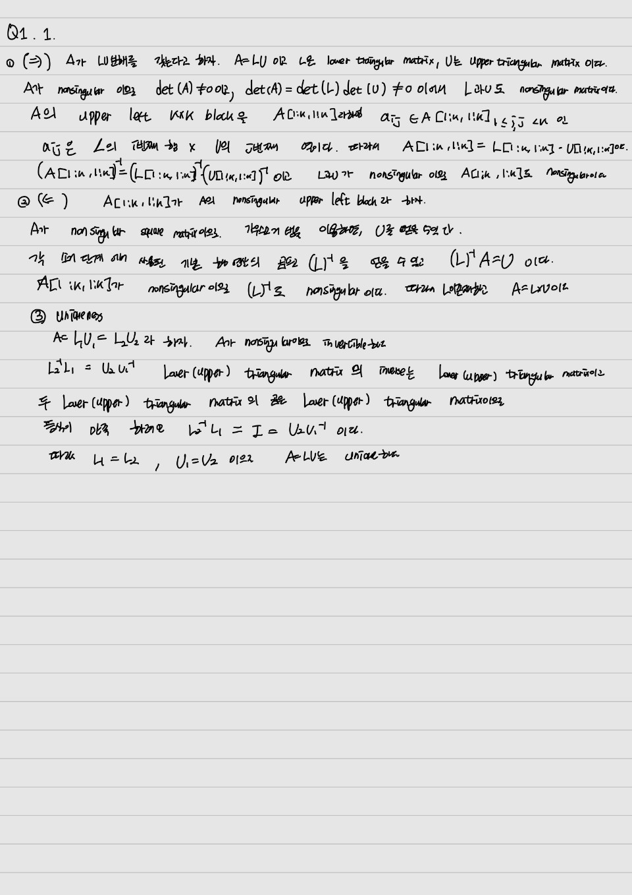
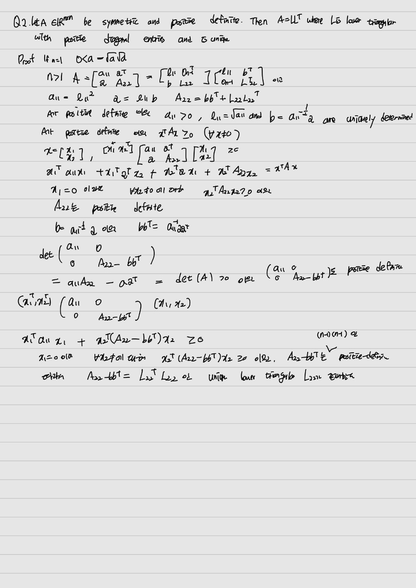
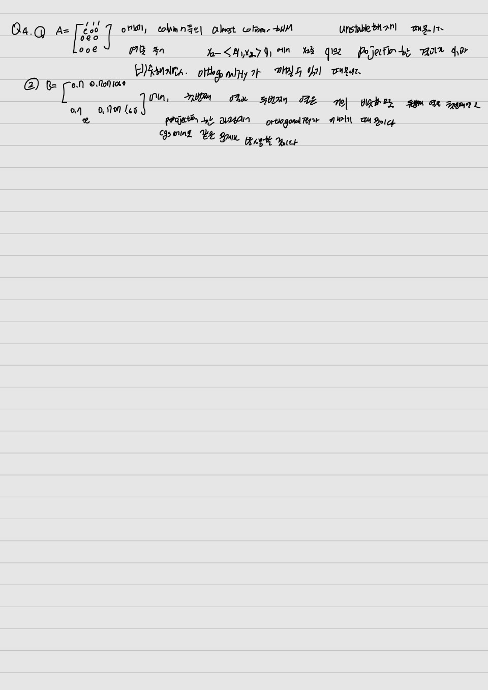
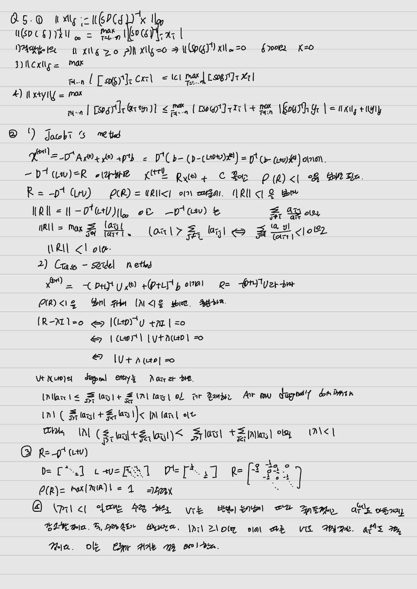

# M1399.0001000 Homework 2, Spring 2024, Seoul National University

Due 23:00 2023-04-28

#### Note

Append your answer below each question. Submit the modified version of
this `Rmd` file and the output `pdf` file, together with other necessary
files such as images and R source code. The submitted version of this
`Rmd` file should be `knit`ted to a `pdf` file ideally identical to the
submitted one.

#### **When writing your own R code, do NOT use R packages that implement the functions you are asked to write. i.e., you must write your own code from scratch.**

#### You can modify the code chunks below to include your solution.

#### **No late submission is accepted**.

## Q1. LU decomposition

1.  Let $\mathbf{A}\in\mathbb{R}^{n\times n}$ be nonsingular. Show that
    $\mathbf{A}$ has an LU decomposition if and only if for each $k$
    with $1\le k \le n$, the upper left $k\times k$ block `A[1:k,1:k]`
    is nonsingular. Prove that this LU decomposition is unique.



2.  Write the R function `LUdecomp` below that computes the LU
    decomposition of a given matrix with the following interface:

    ```{r}
    LUdecomp <- function(LUobj, tol=1e-8) {
    n <- nrow(LUobj$A)  # assume square matrix
    
    ipiv <- seq_len(n) # array of the permutation indexes of the rows
    info <- 0          # indicator of success
    for (k in seq_len(n-1)) {
        # partial pivoting
        pivot <- k
        curmax <- abs(LUobj$A[k, k])
        
        for (i in k + seq_len(max(n-k, 0))) {
          if (abs(LUobj$A[i,k]) > curmax) {
            curmax <- abs(LUobj$A[i,k])
            pivot <- i
          }
        }
        if (pivot != k) {
        # swap permutation indexes
          temp <- ipiv[k]
          ipiv[k] <- ipiv[pivot]
          ipiv[pivot] <- temp
        
        }
        # swap rows
        for (j in seq_len(n)) {
          temp <- LUobj$A[k, j]
          LUobj$A[k, j] <- LUobj$A[pivot, j]
          LUobj$A[pivot, j] <- temp
        }
        
        # singularity test
        if (abs(LUobj$A[k,k]) < tol){
          info <- k
          break
        }
        else{
          info <- 0
        }
        
        # Gaussian Elimination
        for (i in k + seq_len(max(n-k, 0))) {
          num <- LUobj$A[i,k] / LUobj$A[k,k]
        for (j in k + seq_len(max(n-k, 0))) {
          LUobj$A[i,j] <- LUobj$A[i,j] - num*LUobj$A[k, j]
        }
        }
    }
    return(list(ipiv = ipiv, info = info))
    }
    ```

  The decomposition **must** be done *in place*. That is, if
  $\mathbf{A}=\mathbf{L}\mathbf{U} \in \mathbb{R}^{n\times n}$, the
  $\mathbf{U}$ should overwrite the upper triangular part of the input
  matrix `A`, and the strictly lower triangular part of `A` should be
  overwritten by the same part of the $\mathbf{L}$ matrix computed.     (Where does the diagonal part of $\mathbf{L}$ go?) Since R does not allow
  in-place modification of atomic objects, you are recommended to use a
  [Reference Class](http://adv-r.had.co.nz/R5.html) (RC) object.

The RC for this homework can be declared by

```{r}
setRefClass("LUclass",
  fields = list(
    A = "matrix",  # n * n matrix
    b = "vector"   # vector of length n
  )
)
```

A RC object can be created, for instance, by

```{r}
A <- matrix(c(1.0, 0.667, 0.5, 0.333), nrow=2)
b <- c(1.5, 1.0)
LUobj <- new("LUclass", A=A, b=b)
```
```{r}
LUobj
LUdecomp(LUobj)$LUobj
```


Matrix `A` stored in `LUobj` can be referenced by `LUobj$A`, and vector
`b` can be by `LUobj$b` (field `b` is reserved for the next question).

You must also implement partial pivoting: function `LUdecomp` must
return a `list` that consists of two elements:

The first element `ipiv` of the list is the array of the permutation
indexes of the rows, and the second element `info` is the indicator of
success: if `A` is (numerically) singular, the function must return the
row index where singularity occurs (where may a singularity occur in the
LU decomposition?) as the second return value; otherwise return `0`. Use
`tol` to determine the singularity.

3.  Using the `LUdecomp` function written above, write function
    `LUsolve0` that solves the linear equation
    $\mathbf{A}\mathbf{x} = \mathbf{b}$ with interface

    ```{r}
    LUsolve0 <- function(LUobj) {
    # test if square
    n <- nrow(LUobj$A) 
    if (ncol(LUobj$A) != n)
        stop("Matrix is not square.")
    
    # do LU decomposition
    lu <- LUdecomp(LUobj)
    
    # test singularity of A
    if (lu$info != 0)
      stop()
    
    # in-place permutation of b
    for (i in seq_len(n)) {
      temp <- LUobj$b[i]
      LUobj$b[i] <- LUobj$b[lu$ipiv[i]]
      LUobj$b[lu$ipiv[i]] <- temp
    }
    # forward substitution 
    for (i in seq_len(n)) {
        for (j in seq_len(i-1)) {
          LUobj$b[i] <- LUobj$b[i] - LUobj$A[i, j] * LUobj$b[j]
        }
        LUobj$b[i] <- LUobj$b[i] / LUobj$A[i, i]
    }
    # backsolve 
    for (i in rev(seq_len(n))) {
        for (j in i + seq_len(max(n-i, 0))) {
          LUobj$b[i] <- LUobj$b[i] - LUobj$A[i, j] * LUobj$b[j]
         }
        LUobj$b[i] <- LUobj$b[i] / LUobj$A[i, i]
    }
    return(LUobj$b)
    }
    ```
```{r}
LUsolve0(LUobj)
```
    

again *in place*. That is, in addition to `LUobj$A` overwritten by
`LUdecomp`, vector `LUobj$b` should be overwritten by the solution
$\mathbf{A}^{-1}\mathbf{b}$. Your code should check if `LUobj$A` is
singular and generate an error.

4.  Finally, write a [wrapper
    function](https://en.wikipedia.org/wiki/Wrapper_function) `LUsolve`
    with interface

    ```{r}
    LUsolve <- function(A, b) {
      LUobj <- new("LUclass", A = A, b = b)
      solution = LUsolve0(LUobj)
    return(solution)
    }
    ```

which does **not** alter neither `A` nor `b` but solves
$\mathbf{A}\mathbf{x}=\mathbf{b}$ by calling `LUsolve0`. Compare your
results with the R expression `solve(A, b)`.

5.  Use your `LUsolve` to solve $\mathbf{A}\mathbf{x} = \mathbf{b}$ with
    $\mathbf{A}$ and $\mathbf{b}$ given below.

```{r}
    library(Matrix)
    A <- t(matrix(c(2.0, -4.0, 2.0, 4.0, -9.0, 7.0, 2.0, 1.0, 3.0), ncol=3))  
    b <- c(6.0, 20.0, 14.0)
    ```


```{r}
LUsolve(A, b)
solve(A, b)
```


## Q2. Cholesky decomposition

1.  Complete the *proof of the Cholesky decomposition* in lecture note 3
    on Cholesky decomposition by showing that
    -   $\mathbf{A}_{22}$ is positive definite, and
    -   $\mathbf{A}_{22} - \mathbf{b} \mathbf{b}^T = \mathbf{A}_{22} - a_{11}^{-1} \mathbf{a} \mathbf{a}^T$
        is positive definite of size $(n-1)\times(n-1)$.

## Q3. QR decomposition

1.  From the *lecture note 4 on QR decomposition*, explain why classical
    Gram-Schmidt (`cgs()`) fails with the given matrix `A`.

2.  From the same lecture note, explain why the modified Gram-Schmidt
    (`mgs()`) fails with the given matrix `B`. Will the classical
    Gram-Schmidt succeed?
    


3.  Implement the Householder QR decomposition in R.

-   The algorithm should be **in-place**: let the $\mathbf{R}$ matrix
    occupy the upper triangular part of the input
    $\mathbf{X}\in\mathbf{R}^{n\times p}$. Below the diagonal place the
    vectors $\mathbf{u}_k$ that define the Householder transformation
    matrix
    $\mathbf{H}_k=\mathbf{I}-2\mathbf{u}_k\mathbf{u}_k^T/\mathbf{u}_k^T\mathbf{u}_k$.
    By setting the first element of $\mathbf{u}_k$ to 1, you can fit in
    these vectors in $\mathbf{X}$. The algorithm should fill an
    additional vector storing the values of
    $2/\mathbf{u}_k^T\mathbf{u}_k$. This is how the LAPACK routine
    [`geqrf`](https://netlib.org/lapack/explore-html/df/dc5/group__variants_g_ecomputational_ga3766ea903391b5cf9008132f7440ec7b.html)
    is designed. Note that $\mathbf{Q}$ can be recovered from
    $\mathbf{u}_1, \mathbf{u}_2, \ldots, \mathbf{u}_p$.

-   The algorithm should simultaneously compute the right-hand side of
    the equation that is reduced from the normal equation
    $\mathbf{X}^T\mathbf{X}\beta = \mathbf{X}^T\mathbf{y}$.

-   Stop your algorithm if the input matrix is not full column rank.

-   The function interface should be

    ```{r}
    householder <- function(QRobj, tol=1e-16) {
      n <- dim(QRobj$qr)[1] # additional variable
      p <- dim(QRobj$qr)[2] # additional variable
      if (n < p)
          stop("Column rank is deficient.")
      
      for (j in seq_len(min(n-1,p))) { # no transform for a number if n = p
        # compute R_jj
          R_jj <- sqrt(sum(QRobj$qr[j:n, j]^2))
         
          # set the 1st element of u_j to 1 and compute rest of (unnormalized) u_j
          u_j <- c(1, QRobj$qr[(j+1):n, j])
          

          if ( abs(u_jj) < tol) {
          stop("Column rank is deficient.")
          }
          ## YOUR CODE HERE
          
          # compute scale
          scale <- sum(u_j^2)
          
          # update X[j:n, (j+1):p] with householder matrix generated by u_j
          for (i in j + seq_len(max(p-j, 0))) {
          QRobj$qr[j:n, i] <- QRobj$qr[j:n, i] - 2 * (u_j %*% t(u_j)/scale)
          }
          
          # update RHS
          QRobj$pivot[j] <- j
    
          if (j < p) {
           QRobj$qr[(j+1):n, j] <- u_j[-1]
          }
      }
      return(QRobj)
    }
    ```

taking a Reference Class (RC) object

```{r}
  setRefClass("QRclass",
    fields = list(
    qr    = "matrix",  # n * p matrix, n >= p.
    scale = "vector",  # Householder scalar, length p
    y     = "vector"   # RHS for least squares, length n
    )
  )
```

You may initialize a `QRclass` object by setting
`scale=vector("numeric", p)` and `y=vector("numeric", n)`, for example.

-   Write a separate routine

    ```{r}
    recoverQ <- function(QRobj) {
        # Q = H_1 H_2 ... H_{p-1} I
        n <- dim(QRobj$qr)[1]
        p <- dim(QRobj$qr)[2]
        Q <- diag(n)
        for (j in rev(seq_len(min(n-1,p)))) {
            u_j <- c(1, QRobj$qr[(j+1):n, j])
            scale <- sum(u_j^2)
            Q[j:n, j:n] <- Q[j:n, j:n] - 2 * (crossprod(u_j, Q[j:n, j:n]) / scale) %*% u_j %*% t(u_j)
        }
        Q
    }
    ```

that recovers $\mathbf{Q}$.

-   Using your function, compute the QR decomposition of the matrices
    `A` and `B` of the previous question. Compare the
    orthogonality of the computed $\mathbf{Q}$ matrix.


4.  Use your `householder()` and `recoverQ()` functions to estimate the
    regression coefficients and variance estimate $\hat{\sigma}^2$ of
    the following covariates $\mathbf{x}_1, \mathbf{x}_2$ and the
    response variable $\mathbf{y}$.
    

    ```{r}
    x1 <- c(1, 2, 3, 5, 5, 7)
    x2 <- c(1, 3, 3, 4, 4, 5)
    y <- c(2, 4, 5, 8, 8, 9)
    ```  

## Q4. Least squares

The
[Longley](https://www.itl.nist.gov/div898/strd/lls/data/Longley.shtml)
data set of labor statistics was one of the first used to test accuracy
of least squares computations. This data set is built in R and is
available by calling `data(datasets::longley)`. The Longley data set
consists of one response variable (number of people employed) and six
predictor variables (GNP implicit price deflator, Gross National
Product, number of unemployed, number of people in the armed forces,
'noninstitutionalized' population $\ge$ 14 years of age, year) observed
yearly from 1947 to 1962.

1.  Load the data set into R and construct a data matrix $\mathbf{X}$
    for linear model
    $\mathbf{y}=\mathbf{X}\boldsymbol{\beta} + \boldsymbol{\varepsilon}$.
    Include an intercept in your model.

    -   Using the R command `svd()`, list up the 7 singular values of
        $\mathbf{X}$. What is the condition number of $\mathbf{X}$?
    -   Construct the Gram matrix $\mathbf{G} = \mathbf{X}^T\mathbf{X}$.
        List up the 7 singular values of $\mathbf{G}$. What is the
        condition number of $\mathbf{G}$?
```{r}
library(datasets)
X <- as.matrix(cbind(Intercept = 1, datasets::longley[, -ncol(longley)]))
singular.X <- svd(X)$d
(condition <- max(singular.X) / min(singular.X))
```
```{r}
G<-t(X) %*% X
singular.g <- svd(G)$d
(condition <- max(singular.g) / min(singular.g))
```


2.  Using `householder()` and `recoverQ()` functions you wrote for Q3,
    compute the regression coefficients $\hat{\boldsymbol{\beta}}$,
    their standard errors, and variance estimate $\hat{\sigma}^2$.
    Verify your results using the R function `lm()`.
    
    

3.  Using the Cholesky decomposition of $\mathbf{G}$, compute the
    regression coefficients $\hat{\boldsymbol{\beta}}$, their standard
    errors, and variance estimate $\hat{\sigma}^2$. Compare the results
    with the values of the above question.

## Q5. Iterative method

1.  Show that the norm $\|\mathbf{x}\|_{\delta}$ in the *lecture note 5
    on iterative methods* is indeed a vector norm.

2.  A $n \times n$ matrix $\mathbf{A}$ is strictly column diagonally
    dominant if $|a_{ii}| > \sum_{j \not= i} |a_{ji}|$ for all
    $i=1, \cdots, n$. Can strictly column diagonally dominance of a
    matrix $\mathbf{A}$ guarantee the convergence of the Jacobi method
    and Gauss-Seidel methods to solve
    $\mathbf{A} \mathbf{x} = \mathbf{b}$?

3.  Consider solving the linear system of equations
    $\mathbf{A}\mathbf{x}=\mathbf{b}$ using the Jacobi's method, where

    $$
     \mathbf{A} = \begin{bmatrix}
         2  & -1      &        &        &  \\
         -1 & 2       & -1     &        &  \\
             & \ddots & \ddots & \ddots &  \\
             &        & -1     & 2      & -1 \\
             &        &        & -1     & 2
     \end{bmatrix}
     \in \mathbb{R}^{n\times n}.
     $$

Note the eigenvalues of $\mathbf{A}$ are analytically given by $$
    \lambda_i = 2 - 2\cos\frac{i\pi}{n+1}, \quad i = 1, 2, \dotsc, n.
    $$

a.  Find the spectral radius of $R$, when the Jacobi iteration is
    written as

$$
  \mathbf{x}^{(k+1)} = \mathbf{R}\mathbf{x}^{(k)} + \mathbf{c}.
  $$

Will the iterative algorithm converge?

b.  Let the eigenvector of $A$ associated with the eigenvalue
    $\lambda_i$ be $v_i \in \mathbb{R}^n$. Then we can express the error
    of the iteration as

$$
  \boldsymbol{\varepsilon}^{(k)} := \mathbf{x}^{(k)} - \mathbf{x}^* = a^{(k)}_1\mathbf{v}_1 + a^{(k)}_2\mathbf{v}_2 + \dotsb + a^{(k)}_n\mathbf{v}_n,
  $$

for some scalars $a^{(k)}_1,\dotsc,a^{(k)}_n$;

$\mathbf{x}^*$ is the true solution of
$\mathbf{A}\mathbf{x}=\mathbf{b}$. What can you say about the
attenuation of the sequence $\{a^{(k)}_i\}_{k=1,2,\dotsc}$ for different
values of $i$?
