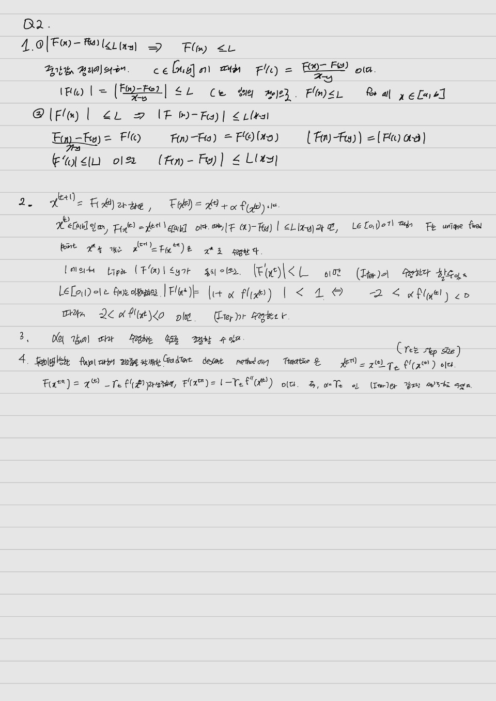
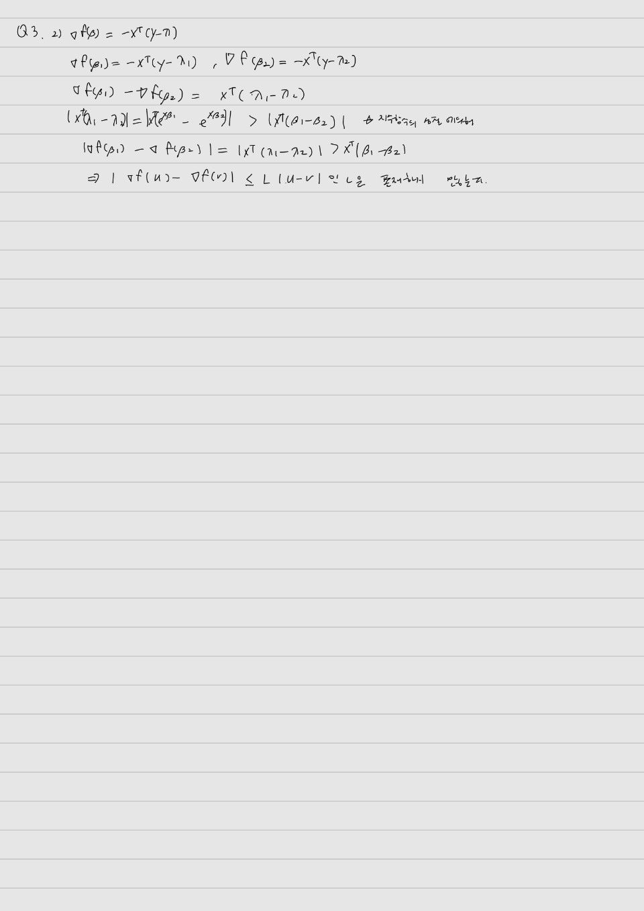
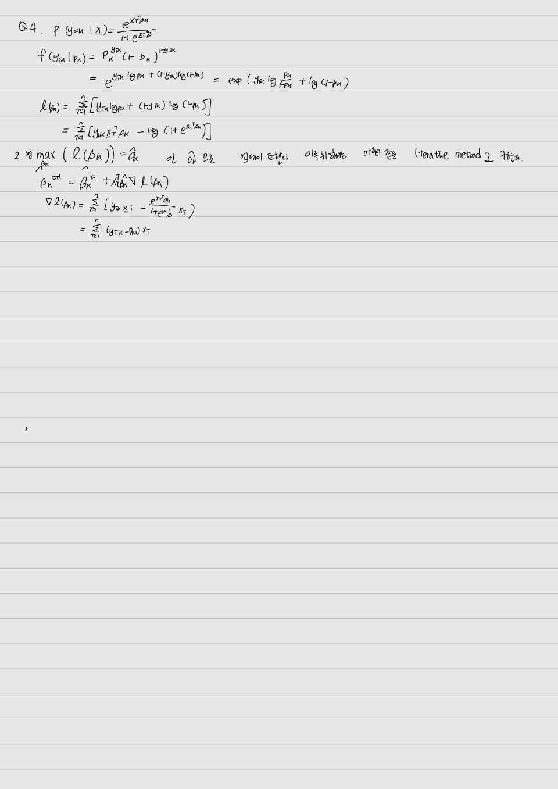

Append your answer below each question. Submit the modified version of
this `Rmd` file and the output `pdf` file, together with other necessary
files such as images and R source code. The submitted version of this
`Rmd` file should be `knit`ted to an `pdf` file ideally identical to the
submitted one.

#### **When writing your own R code, do NOT use R packages that implement the functions you are asked to write. i.e., you must write your own code from scratch.**

#### **No late submission is accepted**.

## Q1. Iterative method

1.  Write an R function `jacobi` implementing Jacobi's method for
    solving linear equation $\mathbf{A}\mathbf{x}=\mathbf{b}$, with
    interface

    ```{r}
    library(Matrix)
    jacobi <- function(A, b, x0,  maxit=100, tol=1.0e-6, history=FALSE, verbose=FALSE) {
        nbrows <- ncol(A)
        x <- x0
        numit <- 0 
        nrmdx <- Inf 
        converged <- FALSE
        xhist <- NULL
        if (history)  {
            xhist <- vector("list", maxit)
        }
        while (numit < maxit) {
            numit <- numit + 1
            x_t <- x
            deltax <- b - A%*%x
            for (i in 1:nbrows){
              deltax[i] = deltax[i]/A[i, i]
            }
            x <- x + deltax
            nrmdx <- norm(deltax, "m")
            if (verbose) {
                print(norm(x-x_t, "2"))
            }
            if (history) xhist[[numit]] <- x
            if (nrmdx < tol) {
                converged <- TRUE
                break
            }
        }
        if (history) xhist <- xhist[seq_len(numit)]
        ret <- list(sol = x, iter = numit, hist = xhist, converged = converged)
        ret
    }
    ```
    
    where `x0` is the initial iterate, `maxit` is the maximum number of
    iteration to run, `tol` is the tolerance for convergence test, and
    `history` and `verbose` are debugging flags; if `history == TRUE`, then
    your function shoud store each iterate $x$ (excluding `x0`) in a list;
    if `verbose == TRUE`, then your function should print the error between
    the current and previous iterates as mesuared by the Euclidean norm.
    
    The return value should be a `list` having four fields: 
    
    - `sol`: `numeric` object of length `ncol(A)` containing the last iterate of the method. 
    - `iter`: number of iterations ran 
    - `hist`: if `history == TRUE`, list of length `iter` containing all the iterates; otherwise `NULL` 
    - `converged`: `logical` variable indicating whether the final error is below `tol`
    
    Assume that $\mathbf{A}$ is square and its diagonal elements are
    nonzero.
    [Vectorize](https://bookdown.org/rdpeng/rprogdatascience/vectorized-operations.html)
    your code as much as possible.
    
    Using the `get2DPoissonMatrix()` function defined in the Lecture Note on
    Iterative Methods for Solving Linear Equations (also provided below),
    generate the coefficient matrix as follows.
    
    ```{r}
    get1DPoissonMatrix <- function(n) {
      Matrix::bandSparse(n, n, #dimensions
                        (-1):1, #band, diagonal is number 0
                        list(rep(-1, n-1), 
                        rep(4, n), 
                        rep(-1, n-1)))
    }
    
    # Generate 2-dimensional discrete Poisson matrix
    #
    #' @param n Grid size. Output will be a n^2 by n^2 matrix.
    get2DPoissonMatrix <- function(n) {  # n^n by n^n
        T <- get1DPoissonMatrix(n)
        eye <- Matrix::Diagonal(n)
        N <- n * n  ## dimension of the final square matrix
        ## construct two block diagonal matrices
        D <- bdiag(rep.int(list(T), n))
        O <- bdiag(rep.int(list(-eye), n - 1))
    
        ## augment O and add them together with D
        D +
         rbind(cbind(Matrix(0, nrow(O), n), O), Matrix(0, n, N)) + 
         cbind(rbind(Matrix(0, n, ncol(O)), O), Matrix(0, N, n))
    }
    
n <- 50
A <- get2DPoissonMatrix(n)
set.seed(456) # seed
b <- rnorm(n^2)
    ```
    
    Then find the solution to `A %*% x = b` using your `jacobi()` function.
    In doing this, use the `hist` field of your return object to produce a
    convergence plot like the following.
    
    {width=50%}

    
```{r}
x0 = rep(0, 50^2)
result <- jacobi(A, b, x0, history = TRUE, maxit = 100)

```
```{r}
errors <- sapply(result$hist, function(x) norm(b - A %*% x, "2"))
```


```{r}
plot(errors, type = "l", xlab = "Iteration") 
```


2.  Repeat the above for the successive over-relaxation (SOR) method,
    with interface

    ```{r}
    sor <- function(A, b, x0, w=1.1, maxit=100, tol=1.0e-6, history=FALSE, verbose=FALSE) {
        nbrows <- ncol(A)
        x <- x0
        numit <- 0 
        xhist <- NULL
        converged = FALSE
        if (history) {
        xhist <- vector("list", maxit)
        }
        while (numit < maxit) {
            numit <- numit + 1
            x_t <- x
            for (i in 1:nbrows) {
            sumj <- sum(A[i,] * x) - A[i, i]* x[i]
            x[i] <- (1 - w) * x[i] + (w / A[i,i]) * (b[i] - sumj)
            }
            error = norm(x-x_t, "2")
            if (verbose) {
                print(error)
            }
            if (history) xhist[[numit]] <- x
            if (error < tol) {
                converged <- TRUE
                break
            }
        }
        if (history) xhist <- xhist[seq_len(numit)]
        ret <- list(sol = x, iter = numit, hist = xhist, converged = converged)
        ret
      }
        
    ```
    
    Experiment with various values of the relaxation parameter `w`.
    

```{r}
result2 <- sor(A, b, x0, w = 0.75, history = TRUE, maxit = 100)
result3 <- sor(A, b, x0, w = 1, history = TRUE, maxit = 100)
result4 <- sor(A, b, x0, w = 1.5, history = TRUE, maxit = 100)
```
```{r}
errors2 <- sapply(result2$hist, function(x) norm(b - A %*% x, "2"))
errors3 <- sapply(result3$hist, function(x) norm(b - A %*% x, "2"))
errors4 <- sapply(result4$hist, function(x) norm(b - A %*% x, "2"))
par(mfrow=c(1,3))
plot(errors2, type = "l", xlab = "Iteration", main = "w= 0.75") 
plot(errors3, type = "l", xlab = "Iteration", main = "w= 1") 
plot(errors4, type = "l", xlab = "Iteration", main = "w= 1.5") 
```

w가 클수록 수렴속도가 빠르다.
    
    Discuss the difference between Jacobi's method and SOR (which includes
    the Gauss-Seidel) in terms of number of iterations to converge,
    [wall-clock time](https://en.wikipedia.org/wiki/Elapsed_real_time) of
    your code, etc. What do you think is the main reasons for the
    differences?
    
    
```{r}
par(mfrow=c(1,2))
plot(errors, type = "l", xlab = "Iteration", main = "Jacobi") 
plot(errors3, type = "l", xlab = "Iteration", main = "SOR") 

```
    
```{r}
library("microbenchmark")
benchmark_results <- microbenchmark(
    jacobi = jacobi(A, b, x0, history = FALSE, verbose = FALSE),
    sor = sor(A, b, x0, w = 1.0, history = FALSE, verbose = FALSE), times = 1
)
```
```{r}
print(benchmark_results)
```


오차가 줄어드는 정도가 SOR이 더 빠르다. 반복에 걸리는 시간은 Jacobi가 더 빠르다. Jacobi에서는 각 반복에 대한 업데이트가 이전 반복의 값만을 기반으로 하므로 수렴 속도가 느리다. SOR에서는 현재 반복 내에서 가장 최근의 값을 활용하기 때문에  방법을 더 빠르게 수렴한다.

3.  (PageRank) Now let us implement the PageRank algorithm using the SOR
    method. The Wikipedia Vote Network dataset, available at
    <https://snap.stanford.edu/data/wiki-Vote.html>, describes the
    voting network among the administrators of Wikipedia. The compressed
    text file `Wiki-Vote.txt.gz` in the SNAP website encodes this
    network in an edgelist format. The number of edges is 103689.


a)  Convert the edgelist into an adjacency matrix. This matrix should be
    a sparse `dgCMatrix` provided in the `Matrix` package. Use the
    `readr::read_tsv()` function to read the edgelist into a `tbl`, a
    tidyverse dataframe. Then convert it into an `igraph` graph
    structure by using
    
```{r}
df <- readr::read_tsv("wiki-Vote.txt.gz", comment = "#", col_names = FALSE)
```

``` {r}
    vote <- igraph::graph_from_edgelist(as.matrix(df), directed=TRUE)
```

    
    where `df` is the `tbl` for the imported edgelist. Finally,
    
    
``` {r}
    A2 <- igraph::as_adjacency_matrix(vote, sparse=TRUE) 
```


    will give you the desired adjacency matrix. The resulting matrix should
    have a dimension 8297 by 8297.

b)  Implement the PageRank algorithm using SOR. Since the `A` matrix is
    sparse and large, your code in Problem 2 is likely very inefficient.
    Recall that we need to solve $$
    (\mathbf{I} - \mathbf{P}^T)\mathbf{x} = \mathbf{0}
    $$ where $\mathbf{P} = (p_{ij})$ with

    $$
    p_{ij} = \begin{cases}
           (1-p)/n + p a_{ij}/r_i, & r_i > 0, \\
           1/n, & r_i = 0;
           \end{cases}
    $$
    
    $r_i$ is the out-degree of node $i$, `A`$= (a_{ij})$, and $p$ is the
    probability of surfing from node i to j. Directly constructing the
    coefficient matrix from `A`, e.g.,

    ``` {r
    B <- Matrix::Diagonal(n)
    for (i in which(outdeg > 0)) {
        for (j in seq_len(ncol(A))) {
            if (A[i,j] > 0) B[i,j] <- B[i,j] - (1 - p) / n - p * A[i,j] / outdeg[i]
        }
    }
    for (i in which(outdeg == 0)) {
        B[i,] <- B[i,] - 1/n
    }
    ```
    
    won't terminate easily in most of laptops. (This is because modifying a
    sparse matrix is not efficient.) Instead, you should implement
    multiplication of each row of $\mathbf{I} - \mathbf{P}^T$ with
    $\mathbf{x}$ *within* the SOR loop, by using only `A` and `p`.
    
    Write an R function `pagerank` with interface

    ```{r}
    pagerank <- function(A, x0, p=0.85,  w=1.5, maxit=100, tol=1.0e-6, history=FALSE, verbose=FALSE) {
        nbrows <- ncol(A)
        r <- apply(A, 1, sum)
        dangling <- which(r == 0) # dangling nodes
        x <- x0
        numit <- 0 
        xhist <- NULL
        converged = FALSE
        if (history) {
        xhist <- vector("list", maxit)
        }
        while (numit < maxit) {
            numit <- numit + 1
            x_t <- x
            for (i in 1:nbrows) {
              if (r[i]>0){
                sumj <- sum(p * A[i, ] * x / r[i])
                x[i] <- (1 - w) * x[i] + w * (sumj + (1 - p) / nbrows)
              } else {
                x[i] <- (1 - w) * x[i] + w * (1 - p) / nbrows
                }
            }
            error = norm(x-x_t, "2")
            if (verbose) {
                print(error)
            }
            if (history) xhist[[numit]] <- x
            if (error < tol) {
                converged <- TRUE
                break
            }
        }
        if (history) xhist <- xhist[seq_len(numit)]
        
        if (any(x < 0)) {
        warning("Method converged but the solution has negative elements.")
        }
        ret <- list(sol = x, iter = numit, hist = xhist, converged = converged)
        ret
    }
    ```

    implementing this idea. Your return object should be the same as `sor()`
    above, but should additionally check nonnegativity of your solution to
    generate a warning "Method converged but the solution has negative
    elements." Write your function by completing the skeleton code above.
    
    Apply your `pagerank()` to the Wikipedia Vote Network dataset with
    $p=0.85$, convert your solution to probability, and report the top 10
    nodes in terms of the PageRank score.
```{r}
n2 <- nrow(A2)
x02 <- rep(1/n2, n2)

resultp <- pagerank(A2, x02)

```
```{r}
score <- resultp$sol / sum(resultp$sol)
top10 <- order(score, decreasing = TRUE)[1:10]
top10
```

## Q2. Contraction map

Recall that function $F: [a,b] \rightarrow [a,b]$ is *contractive* if
there exists a nonnegative constant $L<1$ such that $$
|F(x) - F(y)| \le L |x-y|  
\tag{Lip}
$$ for all $x,y \in [a,b]$.

1.  Show that if $F$ is differentiable on $[a,b]$, then condtion (Lip)
    is equivalent to $$
     |F'(x) | \le L
     $$ for all $x \in [a,b]$.

Now suppose we want to find a root of a differentiable function $f(x)$
on $(a,b)$. Consider the following iteration 

$$
    x^{(t+1)} = x^{(t)} + \alpha  f(x^{(t)}) \quad (\alpha \neq 0).
    \tag{Iter}
$$

2.  When does iteration (Iter) converge?

3.  Discuss the advantage of introducing the $\alpha$.

4.  Relate iteration (Iter) with the gradient descent method for
    minimization of a twice differentiable function.




## Q3. Poisson regression

1.  In the lecture note on optimization, we used step-halving in the
    Fisher scoring of the Poisson regression analysis of the quarterly
    count data of AIDS deaths in Australia. Repeat this using the
    **Armijo rule**. Use the interface

    ```{r}
    poissonreg <- function(x, y, maxiter=10000, tol=1e-6, alpha=.2, gamma=.6) {
        beta0 <- matrix(0, nrow = 2, ncol=1)
        betaold <- beta0
        stop <- FALSE
        iter <- 1
        beta <- beta0
        inneriter <- rep(0, maxiter)
        
        lik <- function(bet) {eta <- bet[1] + bet[2]*x; sum(y*eta - exp(eta))}
        likold <- lik(betaold)
        while ((!stop) && (iter < maxiter)) {
            eta <- beta[1] + x * beta[2]
            w <- exp(eta)  # lambda
            grad <- as.matrix(c(sum(y-w), sum((y-w)*x)))
            # line search by Armijo rule
            s <- 1.0
            while (TRUE && (inneriter[iter] < 10)) {
                beta <- beta + s * grad /sum((x^2*w))
                curlik <- lik(beta)
                likold <- likold + alpha*s*sum(grad/sum((x^2*w)))
                if (curlik > likold) break
                s <- s * gamma
                inneriter[iter] <- inneriter[iter] +1
            }
            #print(c(as.numeric(beta), inneriter[iter], curlik, likold))
            betadiff <- beta - betaold
            if (norm(betadiff, "F") < tol) stop <- TRUE 
            betaold <- beta
            likold <- curlik
            iter <- iter + 1
        }
        return(list(val=as.numeric(beta), iter=iter, inneriter=inneriter[1:iter]))
    }
    ```

    where `alpha` and `gamma` corresponds to the Armijo rule parameters
    $\alpha$ and $\beta$, respectively. Also, execute the following code.
    
    ``` {r}
    # Test code
    deaths <- c(0, 1, 2, 3, 1, 4, 9, 18, 23, 31, 20, 25, 37, 45)
    quarters <- seq_along(deaths)
    poissonreg(quarters, deaths)$val
    ```

2.  In the same lecture note, it is stated that Poisson regression has
    the objective function
    $f(\beta) = -\sum_{i=1}^n \left[ y_i \mathbf{x}_i^T \beta - \exp(\mathbf{x}_i^T \beta) - \log(y_i!) \right]$
    and its gradient

    \begin{align*}
     \nabla f(\beta) &= -\sum_{i=1}^n \left( y_i \mathbf{x}_i - \exp(\mathbf{x}_i^T \beta)\mathbf{x}_i \right) \\
     &= -\sum_{i=1}^n (y_i - \lambda_i) \mathbf{x}_i = -\mathbf{X}^T (\mathbf{y} - \boldsymbol{\lambda})
    \end{align*} 
    
    where $\mathbf{X}$ is the design matrix, $\mathbf{y}$ is the response
    
    is *not* Lipschitz continuous. Show this.


## Q4. Gradient descent

1.  In $K$-class logistic regression, we observe $n$ independent
    categorical variables with $K > 2$ categories, each associated with
    covariates. Let $\mathbf{y}_i$ be the $i$th observation and
    $\mathbf{x}_i \in \mathbf{R}^p$ be the associated covariate vector.
    We use a dummy variable encoding for the response so that
    $\mathbf{y}_i$ is a $K$-dimensional binary vector with only one
    component being 1. Let $p_k$ be the probability of the $k$th
    category. We want to model the logit transform of $p_k$ as a linear
    function of the covariate $\mathbf{x}_i$. Due to the constraint
    $\sum_{k=1}^K p_k = 1$, we set

    $$
    \log\frac{p_k}{p_K} = \mathbf{x}_i^T\boldsymbol{\beta}_k
    ,
    \quad
    k = 1, \dotsc, K - 1
    $$
    
    and $\boldsymbol{\beta}_K = 0$.

a.  Express the log likelihood of the data in terms of the matrices
    $\mathbf{Y} = (y_{ik}) \in \mathbb{R}^{n \times K}$ and
    $\mathbf{X} = [\mathbf{x}_1, \dotsc, \mathbf{x}_n]^T$ or their
    components. You may ignore terms irrelevant to
    $\boldsymbol{\beta}_k$.
b.  Write down a gradient ascent step for estimating coefficients
    $\mathbf{B} = [\boldsymbol{\beta}_1, \dotsc, \boldsymbol{\beta}_{K-1}]$.
    


## Q5. IRLS

1.  A researcher is interested in how variables, such as GRE (Graduate
    Record Exam scores), GPA (grade point average) and prestige of the
    undergraduate institution, effect admission into graduate school.
    The response variable, admit/don't admit, is a binary variable.  \
    The data is available at
    <https://stats.idre.ucla.edu/stat/data/binary.csv>. How to analyze
    these data can be found in the website
    <https://stats.idre.ucla.edu/r/dae/logit-regression/>. You can use
    the following code to load the data.

    ```{r}
    mydata <- read.csv("binary.csv")
    ```

    Implement the iteratively reweighted least squares (IRLS) algorithm for
    fitting a logistic regression model, and apply your algorithm to the
    admission data above. Use the interface below.
    
    ```{r}
    logistic <- function(y, X, beta0=NULL, maxiter=500, tol=1e-8) {
        beta0 <- rep(0, ncol(X))
        betaold <- beta0
        stop <- FALSE
        iter <- 1
        inneriter <- rep(0, maxiter)
        beta <- beta0
        lik <- function(bet) {eta <- X%*%bet ; sum(y*eta - log(1+exp(eta)))}
        likold <- lik(betaold)
        while ((!stop) && (iter < maxiter)) {
            eta <- X %*% betaold
            w <- 1/(1+exp(-eta))
            s<- 1.0
            for (i in 1:length(inneriter)){
              z <- eta + s * (y/w-1)
              m <- lm(z~X - 1, weights = w)
              beta <- as.matrix(coef(m))
              beta[is.na(beta)] = 0
              curlik <- lik(beta)
              if (curlik > likold) break
              s <- s*0.5
              inneriter[iter] <- inneriter[iter] + 1
            }
          betadiff <- beta - betaold
          if (norm(betadiff, "F") < tol) stop <- TRUE
          likold <- curlik
          betaold <- beta
          iter <- iter+1
          
        }
        return(list(coef = as.numeric(beta), iter = iter))
    }
    ```

    The return object should be a list comprised of `coef`, containing the
    fitted regression coefficient, and `iter`, the number of iterations ran.
    Note that the variable `rank` is categorical data.
    
    Compare your result with `glm()` function in R. You can use the
    following code.
```{r}
mydata$rank <- as.factor(mydata$rank)
X <- data.frame(cbind(1, mydata$gre, mydata$gpa, mydata$rank))
X[, 4] <- as.factor(X[, 4])
X2 <- model.matrix(~1+X[, 4])
X <- as.matrix(cbind(X[, 1:3], X2[,2:4]))
head(X)
```
    

    ``` {r}
    logistic(mydata$admit, 
             X , maxiter=500)$coef
    glm(admit ~ gre + gpa + rank, data = mydata, family = "binomial")$coefficients
    ```
결과가 같다.
    
