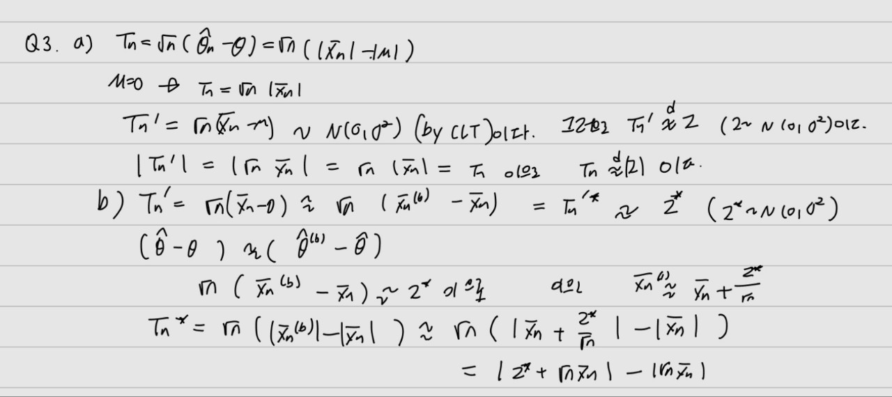

이름 : 박유나
학번 : 2021-12659
```{r}
library(tidyverse)
library(ggplot2)
library(DescTools)
```

```{r}
X = c(8.16, 8.47, 8.63, 9.11, 9.25, 9.45, 9.47, 9.49, 9.91, 9.99, 10.00, 10.18, 10.33, 10.50, 10.99, 11.46, 11.52, 11.55, 11.73, 12.20, 12.20)
```
```{r}
set.seed(1974)
B = 2000 # number of bootstrap samples
n <- length(X)
```

#1 
##a
```{r}
hat.theta = mean(X)
r.boot <- replicate(B, {
  X.b = sample(X, n, replace = TRUE)
  c(mean(X.b), sd(X.b)/sqrt(n))
}) 
r.boot = t(r.boot)
colnames(r.boot) = c("theta*", "se*")
r.boot = as.data.frame(r.boot)
head(r.boot)
```


```{r}

se.est = sd(r.boot$`theta*`)
bias.est = mean(r.boot$`theta*`) - hat.theta
(CI.norm = hat.theta - bias.est + se.est * c(qnorm(0.025), qnorm(1-0.025)) )
```

##b


```{r}
(CI.resid = 2*hat.theta - quantile(r.boot$`theta*`, probs = c(1-0.025, 0.025)))

```

## c

```{r}

b.factor = qnorm( sum(r.boot$`theta*` <= hat.theta)/(B+1))
b.factor

r.jack = vector(length = n)
for (i in 1:n){r.jack[i] =  mean(X[-i]) }
acc = sum((mean(r.jack)-r.jack)^3)/(6*sum((mean(r.jack)-r.jack)^2)^(3/2))
acc

bz = b.factor + qnorm( c(0.025, 1-0.025))
probs = pnorm((bz)/(1-acc*(bz)) + b.factor)
(BCa.CI = quantile(r.boot$`theta*`, probs = probs))
```
## d
```{r}
t.pivot = (r.boot$`theta*` - hat.theta) / r.boot$`se*`
se.hat.theta <- sd(X) / sqrt(n)
(tpivot.CI = hat.theta - se.hat.theta * quantile(t.pivot, probs = c(1-0.025, 0.025)))
```


#2
##a
```{r}
hat.theta2 = median(X)
r.boot2 <- replicate(B, {
  X.b2 = sample(X, n, replace = TRUE)
  c(median(X.b2), sd(X.b2)/sqrt(n))
}) 
r.boot2 = t(r.boot2)
colnames(r.boot2) = c("theta2*", "se2*")
r.boot2 = as.data.frame(r.boot2)
head(r.boot2)
```


```{r}
se.est2 = sd(r.boot2$`theta2*`)
bias.est2 = median(r.boot2$`theta2*`) - hat.theta2

#normal CI
(CI.norm2 = hat.theta2 - bias.est2 + se.est2 *c( qnorm(0.025), qnorm(1-0.025)) )
```


```{r}
#residual CI
(CI.resid2 = 2*hat.theta2 - quantile(r.boot2$`theta2*`, probs = c(1-0.025, 0.025)))

```

```{r}
#BCa CI
b.factor2 = qnorm( sum(r.boot2$`theta2*` <= hat.theta2)/(B+1))
b.factor2

r.jack2 = vector(length = n)
for (i in 1:n){r.jack2[i] =  median(X[-i]) }
acc = sum((median(r.jack2)-r.jack2)^3)/(6*sum((median(r.jack2)-r.jack2)^2)^(3/2))
acc

bz2 = b.factor2 + qnorm( c(0.025, 1-0.025))
probs2 = pnorm((bz2)/(1-acc*(bz2)) + b.factor2)
(BCa.CI2 = quantile(r.boot2$`theta2*`, probs = probs2))
```
## b


```{r}
m <- (n-1)/2
hat.theta.med.se <- sqrt(pi*r.boot2$`se2*`^2 / 4*m)
t.pivot2 <- (r.boot2$`theta2*` - hat.theta2) / hat.theta.med.se
(tpivot.CI2 = hat.theta2 - sqrt(pi*var(r.boot2$`theta2*`) / 4*m) * quantile(t.pivot2, probs = c(1-0.025, 0.025)))
```


## c
```{r}
C <- 100
r.boot3 = replicate(B, {
  X.b = sample(X, n, replace = TRUE)
  theta.boot = median(X.b)
  theta.boot.se = sd(replicate(C, {
    median(sample(X.b, n, replace = TRUE))
  }))
  c(theta.boot, theta.boot.se)
})

r.boot3 = t(r.boot3)
colnames(r.boot3) = c("theta3*", "se3*")
r.boot3 = as.data.frame(r.boot3)
head(r.boot3)
```

```{r}
t.pivot3 = (r.boot3$`theta3*` - hat.theta2) / r.boot3$`se3*`
se.hat.theta3 <- sd(r.boot3$`theta3*`)
(tpivot.CI = hat.theta2 - se.hat.theta3 * quantile(t.pivot3, probs = c(1-0.025, 0.025)))
```


# 3

##c
```{r}
Tn <- numeric(10000)
for(i in 1:10000) {
  X <- rnorm(20, mean=0.3, sd = 1)
  Tn[i] <- sqrt(n)*(abs(mean(X)))
}
Tn2 <- numeric(10000)
for(i in 1:10000) {
  X <- rnorm(20, mean=0.03, sd = 1)
  Tn2[i] <- sqrt(n)*(abs(mean(X)))
}
Tn3 <- numeric(10000)
for(i in 1:10000) {
  X <- rnorm(20, mean=0.003, sd = 1)
  Tn3[i] <- sqrt(n)*(abs(mean(X)))
}
Tn4 <- numeric(10000)
for(i in 1:10000) {
  X <- rnorm(20, mean=0.0003, sd = 1)
  Tn4[i] <- sqrt(n)*(abs(mean(X)))
}
```

```{r}
B<-10000

X <- rnorm(20, mean=0.3, sd = 1)
Tn.1 <- numeric(10000)
X.boot <- replicate(B, {
  mean(sample(X, n, replace = TRUE))
}) 

for(i in 1:10000) {
  X <- rnorm(20, mean=0.3, sd = 1)
  Tn.1[i] <- sqrt(n)*(abs(X.boot[i])-abs(mean(X)))
}

X <- rnorm(20, mean=0.03, sd = 1)
Tn.2 <- numeric(10000)
X.boot2 <- replicate(B, {
  mean(sample(X, n, replace = TRUE))
}) 

for(i in 1:10000) {
  X <- rnorm(20, mean=0.03, sd = 1)
  Tn.2[i] <- sqrt(n)*(abs(X.boot2[i])-abs(mean(X)))
}

X <- rnorm(20, mean=0.003, sd = 1)
Tn.3 <- numeric(10000)
X.boot3 <- replicate(B, {
  mean(sample(X, n, replace = TRUE))
}) 

for(i in 1:10000) {
  X <- rnorm(20, mean=0.003, sd = 1)
  Tn.3[i] <- sqrt(n)*(abs(X.boot3[i])-abs(mean(X)))
}

X <- rnorm(20, mean=0.0003, sd = 1)
Tn.4 <- numeric(10000)
X.boot4 <- replicate(B, {
  mean(sample(X, n, replace = TRUE))
}) 

for(i in 1:10000) {
  X <- rnorm(20, mean=0.0003, sd = 1)
  Tn.4[i] <- sqrt(n)*(abs(X.boot4[i])-abs(mean(X)))
}
```
```{r}
par(mfrow = c(1, 2))
hist(Tn, breaks = 10, main = "Tn 0.3")
hist(Tn.1, breaks = 10, main = "Tnstar 0.3")

```
```{r}
par(mfrow = c(1, 2))
hist(Tn2, breaks = 10, main = "Tn 0.03")
hist(Tn.2, breaks = 10, main = "Tnstar 0.03")
```
```{r}
par(mfrow = c(1, 2))
hist(Tn3, breaks = 10, main = "Tn 0.003")
hist(Tn.3, breaks = 10, main = "Tnstar 0.003")
```
```{r}
par(mfrow = c(1, 2))
hist(Tn4, breaks = 10, main = "Tn 0.0003")
hist(Tn.4, breaks = 10, main = "Tnstar 0.0003")
```

문제를 잘 이해하지 못한 것 같다... Tn과 Tn*의 분포가 비슷하진 않은 것 같다. 하지만 sample mean이 작아질수록 Tn과 Tnstar모두 0에 더 몰려있는 것 같다.


